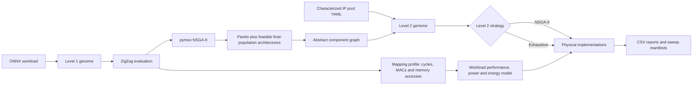

# TALOS

TALOS is a two-level design-space exploration tool for DNN accelerators. It combines workload evaluation with ZigZag, multi-objective search with NSGA-II, and physical IP selection from a characterized component pool.

The project is a research prototype: the included IP values are examples or synthetic data, not sign-off silicon characterization.

## What TALOS does

1. **Level 1 — abstract architecture exploration**
   - Searches a discrete seven-gene architecture space.
   - Evaluates each candidate against an ONNX workload with ZigZag.
   - Optimizes latency, energy, area, or compound objectives with pymoo NSGA-II.
2. **Level 2 — physical implementation exploration**
   - Converts each Level 1 candidate into an abstract component graph.
   - Selects compatible PE, register-file, and global-buffer IP blocks.
   - Uses either NSGA-II or exhaustive enumeration.
   - Evaluates physical area/timing plus workload latency, throughput, average power, and energy.
3. **Reporting and sweeps**
   - Exports Level 1, Level 2, and combined CSV reports.
   - Supports area, power, latency, and frequency constraints.
   - Includes ready-to-run constraint and objective sweeps.

## Architecture



The main modules are:

- `talos/architecture`: Level 1 genome, abstract components, and importers.
- `talos/evaluation`: ZigZag integration, objective adapter, and workload activity extraction.
- `talos/ga`: Level 1 NSGA-II runners and CSV export.
- `talos/ip`: IP characterization models and YAML-backed IP pools.
- `talos/level2`: physical genome, evaluator, NSGA-II/exhaustive runners, and power model.
- `examples`: complete flows, smoke tests, and long sweeps.

### Level 1 genome

Each gene is an integer index into a fixed catalog:

| Gene | Available values |
| --- | --- |
| `pe_x_code` | 4, 8, 16, 32 |
| `pe_y_code` | 4, 8, 16, 32 |
| `rf_size_code` | 64, 128, 256, 512, 1024, 2048 bits |
| `rf_bw_code` | 8, 16, 32, 64, 128, 256 bits/cycle |
| `gb_size_code` | 8192, 16384, 32768, 65536, 131072 bits |
| `gb_bw_code` | 64, 128, 256, 512, 1024 bits/cycle |
| `gb_served_dims_code` | none, D1, D2, or D1+D2 |

DRAM is a fixed platform component selected from the IP pool, not a search gene. Its characterized bus width and power model are passed to ZigZag and reused by Level 2; its area is excluded from the on-chip total.

### Level 1 to Level 2

A decoded Level 1 architecture becomes:

- one `pe_array`, with `pe_x * pe_y` processing elements;
- `rf_i1`, `rf_i2`, and `rf_o`, replicated per PE;
- one or more `gb` instances, with replication determined by the array dimensions not served by the global buffer.

The Level 2 genome has one dynamic gene per abstract component. Each gene selects an IP from the pool after filtering by:

- component type;
- minimum capacity;
- minimum bandwidth.

The exhaustive strategy evaluates every compatible combination up to `--level2-exhaustive-max-combinations`. NSGA-II is preferable when the Cartesian product is large.

The full flow sends Pareto solutions first and can fill `--max-architectures` with distinct feasible individuals from the final Level 1 population. The objective sweep starts with three architectures per objective case.

## Objectives and constraints

### Level 1 objectives

| Objective | Meaning |
| --- | --- |
| `latency` | ZigZag workload latency |
| `energy` | ZigZag workload energy |
| `area` | Current analytical area proxy |
| `edp` | energy × latency |
| `eap` | energy × area |
| `alp` | area × latency |

### Level 2 objectives

| Objective | Meaning |
| --- | --- |
| `area` | Sum of selected IP area × instance count |
| `energy` | Total energy in joules for one workload inference |
| `power` | Average workload power in watts |
| `workload_latency_s` | Batch-1 inference latency from ZigZag mapping cycles |
| `delay` | Legacy physical objective: maximum local IP delay |
| `inv_throughput` | Legacy physical objective: reciprocal of minimum local IP throughput |

Level 1 selects a ZigZag mapping and preserves its per-layer cycles, MAC count, active PEs, operand precision, and physical memory accesses. The ZigZag mapping criterion follows the Level 1 objectives: energy-only uses `energy`, latency-only uses `latency`, and mixed energy/latency or EDP uses `EDP`. Level 2 reuses this profile and never reruns ZigZag for each IP combination.

Workload performance assumes batch 1, sequential layers, no overlap between inferences, and no extra Level 2 stalls:

```text
workload_cycles_per_inference = Σ layer_cycles_mapping
workload_latency_s = workload_cycles_per_inference / (reference_frequency_mhz × 1e6)
workload_throughput_ips = 1 / workload_latency_s

P_PE = active_PEs × p_active_w + idle_PEs × p_idle_w
P_memory = instances × (p_idle_w + utilization × (p_active_w - p_idle_w))
layer_time = layer_cycles / (reference_frequency_mhz × 1e6)
E_inference = Σ(P_layer × layer_time)
P_average = E_inference / workload_latency_s
```

For example, if ZigZag maps a layer onto 16 of `N` PEs, the PE term is exactly `16 × p_active_w + (N - 16) × p_idle_w`. Register-file, global-buffer, and DRAM utilization comes from the accesses in that mapping. DRAM power is derived from its characterized idle/active values and is included in energy and average power.

Memory accesses are normalized from the abstract Level 1 port width to the selected IP width. Every valid combination uses one common characterized `reference_frequency_mhz` and `reference_voltage_v`. Power values are used exactly as characterized, without frequency scaling or interpolation. `physical_fmax_mhz` is the minimum selected-IP `fmax_mhz`; it must meet the reference frequency but never becomes the operating frequency. `physical_critical_delay` and `timing_margin_mhz = physical_fmax_mhz - reference_frequency_mhz` are reported separately.

Level 2 rejects a combination when a selected IP is characterized at an incompatible operating point, misses the reference frequency, cannot provide the mapped PE MACs/cycle, has incompatible operand precision, or cannot sustain the mapped memory accesses/cycle. It preserves the ZigZag cycles rather than inserting stalls or remapping.

The `energy` and `power` objectives use the same model: `energy` minimizes joules per inference, while `power` minimizes time-weighted average watts. Level 2 still evaluates characterized IP area, implementation `fmax`, delay, throughput, and all configured constraints independently of these objectives.

### User constraints

| Option | Stage | Condition |
| --- | --- | --- |
| `--max-latency-cycles` | Level 1 | workload latency must not exceed the limit |
| `--max-area-mm2` | Level 2 | physical IP area must not exceed the limit |
| `--max-power-w` | Level 2 | average workload power must not exceed the limit |
| `--min-frequency-mhz` | Level 2 | implementation `fmax` capability must meet the minimum |

Area, power, and frequency constraints require the full Level 1 → Level 2 flow. `python -m talos` only accepts the Level 1 latency constraint.

## Installation

Python 3.12 is the tested version.

```bash
git clone https://github.com/ThaChoppahIsLookinSharp/talos.git
cd talos

python3.12 -m venv .venv
source .venv/bin/activate
python -m pip install --upgrade pip
python -m pip install -r requirements.txt
```

## Quick start

All commands below are run from the repository root.

### Smoke-test one Level 1 genome

```bash
python -m talos
```

Use `--debug` to show ZigZag output and print the generated mapping and accelerator YAML.

### Run Level 1 NSGA-II

```bash
python -m talos --ga \
  --workload workloads/alexnet.onnx \
  --objectives latency energy area \
  --pop-size 12 \
  --generations 4 \
  --workers 4 \
  --seed 1 \
  --zigzag-lpf-limit 1 \
  --zigzag-spatial-mappings 1 \
  --results-dir results/level1_demo
```

`--workers` parallelizes Level 1 candidate evaluation. Larger ZigZag LPF and spatial-mapping limits explore more mappings but increase runtime.

### Run the complete Level 1 → Level 2 flow

```bash
python examples/full_flow_example.py \
  --workload workloads/alexnet.onnx \
  --ip-pool configs/ip_pool_synthetic_28nm.yaml \
  --level1-objectives latency energy area \
  --level1-pop-size 12 \
  --level1-generations 3 \
  --level2-objectives area energy workload_latency_s \
  --level2-strategy nsga2 \
  --level2-pop-size 24 \
  --level2-generations 4 \
  --max-architectures 4 \
  --workers 4 \
  --seed 1 \
  --results-dir results/full_flow_demo
```

This is the main entry point when Level 2 metrics or physical constraints are needed.

### Run with physical constraints

```bash
python examples/full_flow_example.py \
  --workload workloads/alexnet.onnx \
  --ip-pool configs/ip_pool_synthetic_28nm.yaml \
  --level1-objectives latency energy area \
  --level2-objectives area energy workload_latency_s \
  --max-latency-cycles 100000000 \
  --max-area-mm2 6.0 \
  --max-power-w 1.2 \
  --min-frequency-mhz 600 \
  --level1-pop-size 24 \
  --level1-generations 3 \
  --level2-pop-size 24 \
  --level2-generations 4 \
  --max-architectures 8 \
  --workers 4 \
  --results-dir results/constrained_demo
```

### Use exhaustive Level 2 selection

```bash
python examples/full_flow_example.py \
  --ip-pool configs/ip_pool_synthetic_28nm.yaml \
  --level2-strategy exhaustive \
  --level2-exhaustive-max-combinations 100000 \
  --max-architectures 4 \
  --workers 4 \
  --results-dir results/exhaustive_demo
```

The exhaustive runner raises before enumeration if a search would exceed the configured combination limit; the full-flow example reports that failure and continues with the next architecture.

### Inspect Level 2 independently

```bash
python examples/level2_smoke_test.py
python examples/level2_runner_example.py
```

The smoke test shows the dynamic Level 2 genes and evaluates their default implementation. The runner executes a small Level 2 NSGA-II search.

## Long sweeps

The sweep scripts create a timestamped directory and a `manifest.csv` containing every command, case, result directory, summary path, and return code.

Preview commands before starting a long run:

```bash
python examples/constraint_sweep.py --dry-run
python examples/objective_sweep.py --dry-run
```

Run the seven constraint cases:

```bash
python examples/constraint_sweep.py \
  --workers 8 \
  --level2-strategy exhaustive \
  --results-dir results/constraint_sweep
```

Run all seven objective combinations:

```bash
python examples/objective_sweep.py \
  --workers 8 \
  --level2-strategy exhaustive \
  --max-area-mm2 6.0 \
  --max-power-w 1.2 \
  --min-frequency-mhz 600 \
  --results-dir results/objective_sweep
```

These objective-sweep defaults are calibrated to leave a useful feasible region in the included synthetic pool; they are not silicon design targets. The constraint sweep intentionally uses much tighter values as regression cases. Use `--no-constraints` to compare objectives without area, power, or frequency limits.

## IP pool format

IP pools are YAML files with an `ips` list. The two included pools are:

- `configs/ip_pool_example.yaml`: illustrative values for small examples.
- `configs/ip_pool_synthetic_28nm.yaml`: synthetic values used by tests and sweeps; they are not foundry characterization.

The synthetic pool contains 2 PE, 4 register-file, 7 global-buffer choices, and one fixed DRAM characterization. It covers every Level 1 genome and produces at most 896 compatible on-chip Level 2 combinations for one architecture, so exhaustive selection is normally preferable. Add variants only from a coherent characterization flow rather than inventing extra points for population size.

A minimal PE entry looks like this:

```yaml
ips:
  - id: pe_mac_8b_fast
    type: pe
    area: 0.0013
    throughput: 2.0
    delay: 0.6
    fmax_mhz: 900.0
    metadata:
      precision_bits: 8
      macs_per_cycle: 1
    power_model:
      source: synthetic
      activity_method: vectorless
      reference_frequency_mhz: 500.0
      p_idle_w: 0.00015
      p_active_w: 0.00075
      voltage_v: 1.0
      temperature_c: 25.0
      corner: tt
```

Memory IPs additionally use `capacity_bits`, `bandwidth_bits`, and `metadata.accesses_per_cycle`. The pool must contain exactly one `type: dram` entry for workload-aware Level 2.

`p_idle_w` and `p_active_w` are per-instance power values used directly by the estimator. `reference_frequency_mhz` is both their characterization point and the operating frequency used to convert workload cycles into seconds. Selected IPs must share that frequency and PVT point and meet it with their `fmax_mhz`; no frequency scaling is applied. `voltage_v` records and validates the operating point; it is not added or multiplied into energy. The included values are synthetic, but real values can be obtained from two Genus power scenarios: clocked idle and representative active operation.

Workload-aware exploration requires every selected IP to provide:

- `fmax_mhz`;
- `p_idle_w` and `p_active_w`;
- `accesses_per_cycle` for memories;
- compatible voltage, temperature, and process corner.

## Results

The complete flow writes:

```text
results/full_flow_demo/
├── level1/
│   └── pymoo_nsga2_results_<timestamp>.csv
├── level1_profiles/
├── level2_arch_<index>/
│   └── level2_<nsga2|exhaustive>_results.csv
└── full_flow_summary.csv
```

The combined summary contains columns for:

- raw and discretized Level 1 genomes;
- decoded architecture parameters;
- selected Level 2 IPs;
- objective values;
- workload cycles, seconds per inference, and inferences per second;
- reference frequency/voltage and physical critical delay, `fmax`, and timing margin;
- physical area, average power, workload energy, DRAM accesses, and DRAM energy;
- constraint status and violations;
- paths to the detailed Level 1 and Level 2 CSVs.

The full flow always generates one mapping profile for each Level 1 architecture passed to Level 2, so workload metrics and capacity checks are available independently of the selected Level 2 objectives.

Generated `results/`, `outputs/`, and `.talos_zigzag/` directories are ignored by Git.

## Python API

Level 2 can also be driven directly:

```python
from talos.architecture import (
    abstract_accelerator_from_level1_config,
    decode_genome,
    default_genome,
)
from talos.ip import IPPool
from talos.level2 import run_level2

config = decode_genome(default_genome())
accelerator = abstract_accelerator_from_level1_config(config)
pool = IPPool.from_yaml("configs/ip_pool_synthetic_28nm.yaml")

result = run_level2(
    accelerator=accelerator,
    ip_pool=pool,
    objective_names=["area", "delay", "inv_throughput"],
    strategy="exhaustive",
    save_csv=False,
)

for solution in result.solutions[:3]:
    print(
        solution["selected_ips"],
        solution["area"],
        solution["physical_critical_delay"],
    )
```

For `energy`, `power`, or `workload_latency_s`, also pass the `WorkloadActivityProfile` produced by the corresponding Level 1 ZigZag mapping.

## Development

Run the test suite with:

```bash
python -m unittest discover -s tests -v
```

Useful help commands:

```bash
python -m talos --help
python examples/full_flow_example.py --help
python examples/constraint_sweep.py --help
python examples/objective_sweep.py --help
```

## Current limitations

- The repository is a research prototype, not a calibrated PPA sign-off flow.
- The synthetic 28 nm pool exists for repeatable tests and exploration only.
- Level 1 area is an analytical proxy unless a backend provides a physical area result.
- DRAM is a fixed, characterized platform IP and is excluded from Level 2 on-chip area, but included in workload power and energy.
- Characterizations currently provide one discrete operating point per IP; voltage/frequency interpolation is not implemented.
- The ZigZag adapter currently preserves aggregate physical accesses per memory level, not separate read/write/operand port demand. Level 2 therefore validates aggregate accesses/cycle against `metadata.accesses_per_cycle`.
- `delay` and `inv_throughput` are legacy local-IP objectives, not inference performance. Use `workload_latency_s` for workload performance.
- Exhaustive Level 2 runtime grows as the product of compatible candidates per component.

## Main dependencies

- [ZigZag](https://github.com/KULeuven-MICAS/zigzag) for workload and mapping evaluation.
- [pymoo](https://github.com/anyoptimization/pymoo) for NSGA-II.
- ONNX, NumPy, pandas, PyYAML, matplotlib, and related scientific Python packages.

See `requirements.txt` for pinned versions.

## License

MIT. See `LICENSE`.
